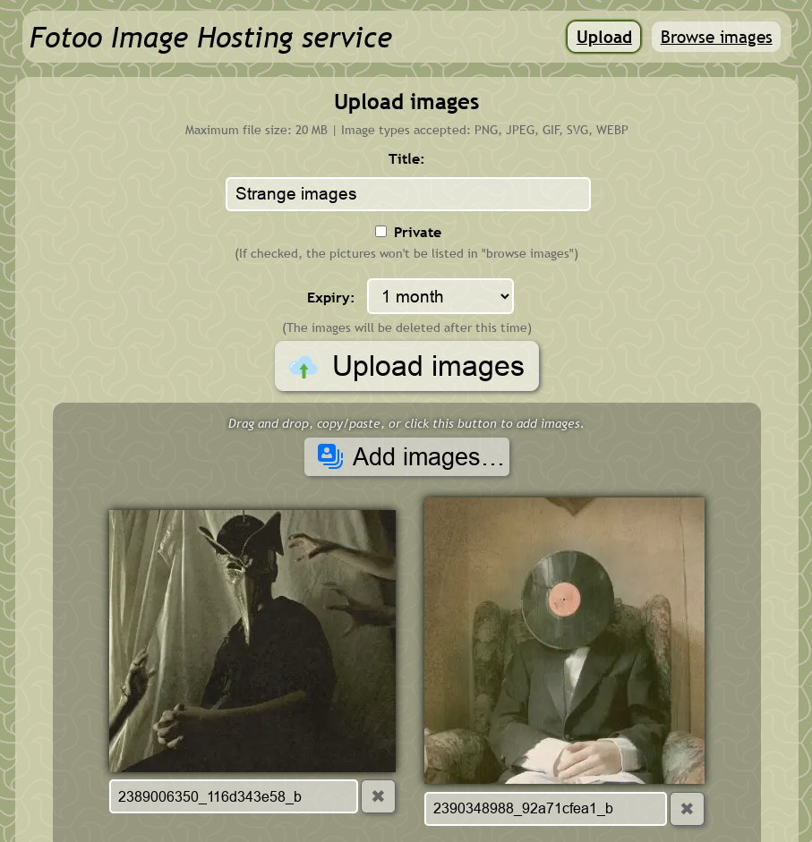

# Fotoo

Fotoo (previously Fotoo Hosting) is a script aimed to be used as a image hosting web-service, like imgur and others.

## Features

* Lightweight, fast
* Using SQLite3 database, nothing to install
* Images are resized in the browser before upload:
  * zero computing resource taken on server
  * image upload is faster for the user
  * less data usage on mobile plans!
  * fallback to server resize for clients without javascript
* Accepts WEBP, JPEG, PNG, SVG and GIF (even animated GIF files and transparent PNGs)
* Preview before upload
* Fast static image view
* Can upload multiples pictures at a time (albums)
* Small thumbnail created for each picture
* Can associate a title to each picture
* List of the pictures hosted
* Can make an album private (won't appear in list)
* Easy deletion of pictures
* Short URL for images, for use with twitter-like websites
* Easy integration of pictures in forums and blogs, using either BBcode or HTML
* Fast resize using the best engine available (from either IMlib, Imagick or GD)
* Configuration can be easily changed
* Intelligent image resize for GIF and PNG files (if created thumb is too big (>50KB) then the thumb will be made in JPEG to keep small image size)
* Supports IP address banning to protect from spammers

## Demo

Demo: [i.kd2.org](https://i.kd2.org/) (upload is disabled)



## Install guide

Just download the [fotoo.php](/file?name=fotoo.php&ci=tip) file, rename it to `index.php`, and place it in an empty directory of your web server, and open it in your web browser.

You will need php7.4-sqlite3 for the database and php7.4-imagick for the image resizing, but you can also use php7.4-gd (slower).

## Upgrade guide

Migration from versions 2.0.x to 2.1.x require a small upgrade to the database schema, see changelog notes below.

Other versions don't require anything.

## ChangeLog

### 3.2.0 (September 2024)

* Add support for copy/pasting images directly
* Add support for drag and dropping images
* Improve position and size of previous/next buttons when viewing an image

### 3.1.0 (June 2023)

*  Simplify albums and single images: merge them for upload and browsing
*  Ability to add/remove images from upload list
*  Use WebP by default for smaller images
*  Improve UI/UX
*  Add ability to define an expiry for albums and images
*  Thumbnail is now generated by the browser as well (zero server load!)
*  Better handling of SVG and transparent PNG/WebP images
*  When navigating in images of an album after upload, keep the session key in URL so that individual images can be deleted

### 2.2.0 (May 2020)

*  Add ability to download an album as a ZIP file

### 2.1.1 (march 2016)

*  Fix BBcode for albums

### 2.1.0

UPGRADE! To upgrade your local database open it with SQLite3 client and enter:
<pre>ALTER TABLE pictures ADD COLUMN ip TEXT NULL;</pre>

This will add a new column necessary for the new IP storage.

*  Allow to remove multiple images or albums at once (admin mode)
*  Now storing IP address of uploaders
*  Automatic IP storage expiration (to remove IP addresses after X days according to local laws)
*  IP banning (supports masks, wildcards and IPv6) in local configuration

### 2.0.1

*  Fix: Don't force Imagick use
*  Fix: JS bug fix in single file upload when selected file was changed
*  Fix: password security in javascript

### 2.0.0
*  Complete rewrite and redesign using client-side Javascript/Canvas/HTML5 resize
*  Ability to upload multiple pictures at a time in albums
*  Admin mode is easier to use

### 1.0.0
*  Initial release with Flash-based client resize and upload

## License

This software is free software: you can redistribute it and/or modify
it under the terms of the GNU Affero General Public License as published by
the Free Software Foundation, either version 3 of the License, or
(at your option) any later version.

This software is distributed in the hope that it will be useful,
but WITHOUT ANY WARRANTY; without even the implied warranty of
MERCHANTABILITY or FITNESS FOR A PARTICULAR PURPOSE.  See the
GNU General Public License for more details.

You should have received a copy of the GNU Affero General Public License
along with this software. If not, see <http://www.gnu.org/licenses/>.

## FAQ

### What is the password to login and delete pictures and albums?

The default password is `fotoo`, to change it follow the next question and change:

```
$config->admin_password = 'fotoo';
```

to the password you like the most.

### How can I change the configuration of the software?

Just go on the service URL and add `?create_config` to the URL. This way the default config will be written in the `config.php` file. You'll just have to edit this file, and comment out the lines you want to change.

### How can I change the style?

Just create a file named style.css in the same directory as the application.

### How can I change the size of allowed pictures?

The best way to do this is to edit the .htaccess in the directory where you installed the software and add this:

```
php_value upload_max_filesize 8M
```

Change 8M by the size you want to allow (see the [PHP FAQ](http://www.php.net/manual/en/faq.using.php#faq.using.shorthandbytes) to know what notations are allowed).

Please note that you'll be also limited by the [post_max_size](http://www.php.net/manual/en/ini.core.php#ini.post-max-size) value, which you might need to change too:

```
php_value upload_max_filesize 16M
php_value post_max_size 16M
```

By default, Fotoo will take as the size limit the smallest value of those configuration directives.

### Hint: upload pictures from the command line

If you want to upload a picture from your computer to your Fotoo instance, you'll need curl and to use this command:

```
curl -i -F name="Image title" -F private=0 -F upload=@mypicture.jpg http://fotoo.example.com/?upload | grep '^Location' | sed 's/^Location: //'
```

Replace `"Image title"` and `"mypicture.jpg"` with your own image title and image file. Replace `private=0` with `private=1` to tell Fotoo to hide the picture from the public gallery.

### Hint: enable user cache so that clients don't make a lot of requests

Write this into the .htaccess of the directory where you installed this software:

```
<FilesMatch "\.(jpg|png|gif)$">
  FileETag none

  ExpiresActive on
  ExpiresDefault "access plus 90 days"
</FilesMatch>
```

You'll need to have mod_expire enabled.

### How can I have good looking URLs like you have on i.kd2.org?

Pretty easy, add this to your config.php:

```
$config->image_page_url = substr($config->image_page_url, 0, -1);
$config->album_page_url = substr($config->image_page_url, 0, -2) . 'a=';
```

And add this to the .htaccess in the directory where you have put the software:

```
RewriteEngine On
RewriteCond %{REQUEST_FILENAME} !-f
RewriteRule ^(.*) /index.php?$1 [QSA,L]
```

You might need to change the `/index.php` path if you're not at the root. eg. if you put the software in `http://example.com/hosting/` you will have to change `/index.php` to `/hosting/index.php`.

### How can I restrict upload access by login/password?

It's easy, create the config file (see above), find the line with this:

```
#$config->allow_upload = true;
```

And replace it with this:

```
$config->allow_upload = 'check_upload_access';

function check_upload_access()
{
    $username = 'fotoo';
    $password = 'abcd';

    if (isset($_SERVER['PHP_AUTH_USER']) && isset($_SERVER['PHP_AUTH_PW'])
        && $_SERVER['PHP_AUTH_USER'] == $username && $_SERVER['PHP_AUTH_PW'] == $password)
    {
        return true;
    }
    else
    {
        header('WWW-Authenticate: Basic realm="FotooHosting"');
        header('HTTP/1.0 401 Unauthorized');
        die("Unauthorized access forbidden!");
    }
}
```

Don't forget to replace username and password with your own.
